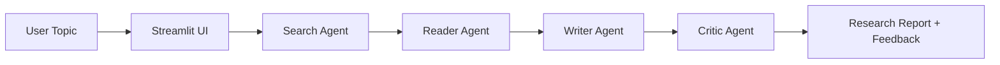

# ✨ Multi-Agent Research System

A sleek Streamlit-powered research assistant that orchestrates multiple AI agents to investigate a topic, gather information from the web, synthesize a report, and critique the result.


## Overview

This project turns a simple research prompt into a multi-step, agentic workflow:

- A search agent finds recent and relevant sources
- A reader agent picks the strongest URL and extracts deeper context
- A writer agent composes a polished research report
- A critic agent reviews the report and provides structured feedback

The app is designed to feel like a lightweight research lab in your browser, making it easy to explore topics quickly and generate readable output with minimal setup.

---

## Architecture



---

## Features

- 🧠 Multi-agent collaboration using LangChain
- 🔎 Web search with Tavily
- 📄 URL content extraction and summarization
- ✍️ Structured written research output
- 🧾 Critique layer with strengths, gaps, and verdict
- 🌐 Friendly web interface via Streamlit
- 📦 Simple environment-driven configuration

---

## Project Structure

```text
Multi-agent-research-system/
├── agents.py            # Agent definitions and prompts
├── app.py               # Streamlit frontend
├── pipeline.py          # Research orchestration flow
├── tools.py             # Tavily search + scraping tools
├── requirements.txt     # Python dependencies
├── README.md            # Project documentation
├── .env                 # Local environment variables (create this)
└── .gitignore           # Git exclusions
```

---

## Tech Stack

- Python 3.10+
- Streamlit
- LangChain
- LangChain Google Generative AI
- Tavily Search API
- BeautifulSoup
- Requests
- python-dotenv

---

## Setup

### 1) Clone the repo

```bash
git clone https://github.com/your-username/Multi-agent-research-system.git
cd Multi-agent-research-system
```

### 2) Create a virtual environment

```bash
python3 -m venv .venv
source .venv/bin/activate
```

### 3) Install dependencies

```bash
pip install -r requirements.txt
```

### 4) Add environment variables

Create a `.env` file in the project root:

```env
GOOGLE_API_KEY=your_google_api_key_here
GEMINI_MODEL=gemini-2.5-flash
TAVILY_API_KEY=your_tavily_api_key_here
```

> You’ll need:
> - a Google AI API key for Gemini
> - a Tavily API key for web search

---

## Run the app

Start the Streamlit interface:

```bash
streamlit run app.py
```

Then open the local URL shown in the terminal, usually:

```text
http://localhost:8501
```

---

## How the pipeline works

When you enter a topic, the app runs this flow:

1. Search Agent
   - Queries Tavily for recent, relevant search results
   - Returns titles, URLs, and snippets

2. Reader Agent
   - Selects a promising URL
   - Scrapes and extracts readable content

3. Writer Agent
   - Produces a structured report with:
     - Introduction
     - Key Findings
     - Conclusion
     - Sources

4. Critic Agent
   - Reviews the final report
   - Provides score, strengths, improvement areas, and verdict

---

## Example use case

Try prompts like:

```text
Advances in solid-state battery technology
The future of AI in healthcare workflows
Sustainable urban mobility trends in 2026
```

The system will gather sources and generate a structured, professional-looking summary.

---

## Notes

- The current workflow is optimized for research exploration and report generation rather than deep academic validation.
- Search quality depends on the reliability of the external sources and the model configuration.
- For production use, consider adding result caching, source validation, and stronger output guardrails.

---

## License

This project is provided as-is for learning and experimentation.

---

## Contributing

Pull requests and ideas are welcome. If you improve the workflow, validator logic, UI, or research quality, feel free to share your changes.

---

## Built for curious minds

This project is a compact, elegant starting point for building more advanced research agents that can explore the web, understand context, and produce thoughtful written analysis.
